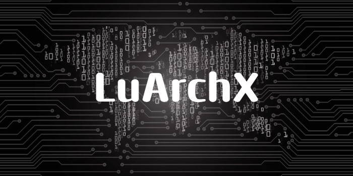

[]

# Hello World !, I'm Soulaym 👋

## 📈 My GitHub stats

  

    
    
  

### 
⚙️ My development environment 

> I grew up using both Windows and macOS, but when I discovered Linux, I immediately fell in love with it. Linux has since become a core interest of mine, and I continually explore its possibilities for development and customization. Using tools like the Windows Subsystem for Linux (WSL) and the Windows Terminal has allowed me to integrate aspects of Linux into my workflow on multiple platforms. I’ve also customized my terminal experience, creating an efficient and tailored environment that combines the best features from all three operating systems.

  <table style="font-size: 11px">
  <tr>
  <td valign="top" width="50%">

#### 🖥️ Windows PowerUser

Accelerating my workflow and productivity on Windows with the following tools and configurations:

  </td>
  <td valign="top" width="50%">

#### 🐧 Linux Enthusiast

I love working with Linux, and I'm always exploring new things in the vast open-source world.

  </td>
  </tr>
  </table>

### Tools i use

---

<!---
LuArchX/LuArchX is a ✨ special ✨ repository because its `README.md` (this file) appears on your GitHub profile.
You can click the Preview link to take a look at your changes.
--->
